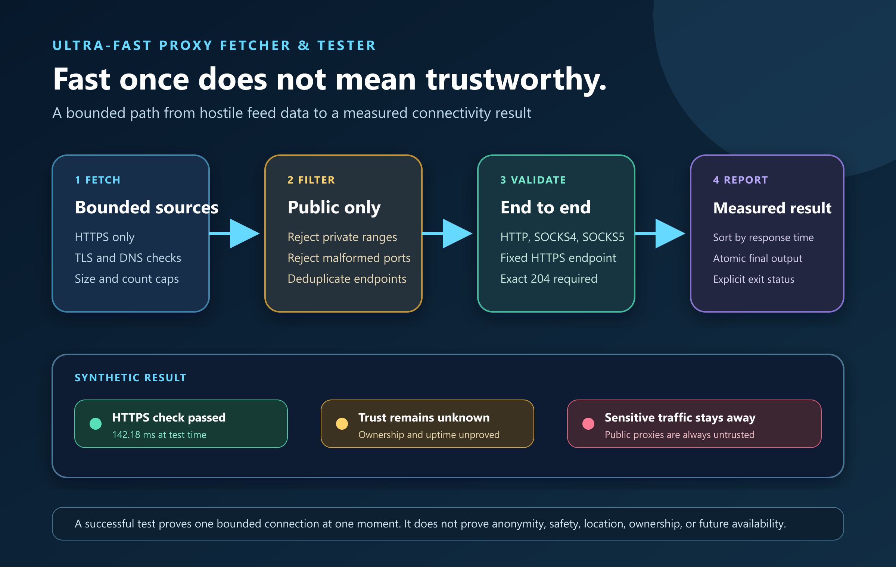

# Ultra-Fast Proxy Fetcher & Tester

[](https://github.com/fusiontechstrategies/Ultra-Fast-Proxy-Fetcher-Tester/actions/workflows/ci.yml)
[](https://www.python.org/)
[](LICENSE)

Fetch, validate, rank, and save public HTTP, SOCKS4, and SOCKS5 proxy endpoints with one Python script. The engine uses bounded asynchronous concurrency, strict public-address filtering, and an end-to-end HTTPS connectivity check.

[](docs/images/source/proxy-validation-pipeline.svg)

This project is intended for authorized network testing, software development, and research. Public proxies are untrusted. Never send credentials, personal information, proprietary data, or other sensitive traffic through an endpoint produced by this tool.

Version 2.0.1 is the current verified release. Download the [standalone runtime, Python distributions, and integrity files](https://github.com/fusiontechstrategies/Ultra-Fast-Proxy-Fetcher-Tester/releases/tag/v2.0.1) from the release page.

## Why this version is different

- Fetches concurrently from 52 curated HTTPS sources validated on 2026-08-12.
- Rejects private, loopback, link-local, multicast, reserved, malformed, and invalid-port entries before attempting a proxy connection.
- Validates HTTP CONNECT, SOCKS4, and SOCKS5 transports against a fixed HTTPS endpoint that must return exactly `204`.
- Blocks unsafe source URLs and redirects, verifies source TLS, checks DNS destinations, and caps decompressed response sizes.
- Uses bounded worker pools, source concurrency, timeouts, and a default 5,000-candidate safety cap.
- Caps every source at 5 MiB and 10,000 unique endpoints to constrain hostile or malformed feeds.
- Does not display third-party proxy addresses in live progress output.
- Atomically invalidates stale output before testing and replaces it with the completed report, including when no proxies work.
- Keeps all application logic in [`proxy_fetcher_ultimate.py`](proxy_fetcher_ultimate.py).

## Requirements

- Python 3.10 or newer
- Internet access to the configured source hosts and HTTPS connectivity endpoint

## Installation

Install the [PyPI 2.0.1 package](https://pypi.org/project/ultra-fast-proxy-fetcher-tester/2.0.1/) for the `proxy-fetcher-tester` command:

```bash
python -m pip install ultra-fast-proxy-fetcher-tester==2.0.1
proxy-fetcher-tester --help
```

To work from the standalone source, clone the repository:

```bash
git clone https://github.com/fusiontechstrategies/Ultra-Fast-Proxy-Fetcher-Tester.git
cd Ultra-Fast-Proxy-Fetcher-Tester
python -m venv .venv
```

Activate the environment on Windows:

```powershell
.venv\Scripts\Activate.ps1
```

Activate it on Linux or macOS:

```bash
source .venv/bin/activate
```

Install the runtime dependencies:

```bash
python -m pip install --upgrade pip
python -m pip install -r requirements.txt
```

## Usage

Run with safe defaults:

```bash
python proxy_fetcher_ultimate.py
```

Fetch and validate source data without testing or saving proxy endpoints:

```bash
python proxy_fetcher_ultimate.py --fetch-only
```

Test a smaller HTTP-only sample:

```bash
python proxy_fetcher_ultimate.py --protocol http --max-candidates 500 --concurrent 50
```

Choose a different output file and hide live progress:

```bash
python proxy_fetcher_ultimate.py --output results/proxies.txt --quiet
```

Show every option and its enforced bounds:

```bash
python proxy_fetcher_ultimate.py --help
```

Show the stable product version:

```bash
python proxy_fetcher_ultimate.py --version
```

### Important defaults

| Setting | Default | Enforced maximum |
|---|---:|---:|
| Proxy checks | 100 concurrent | 500 |
| Source downloads | 12 concurrent | 32 |
| Candidates tested | 5,000 | 50,000 |
| Proxy timeout | 8 seconds | 30 seconds |
| Source timeout | 12 seconds | 30 seconds |

Actual throughput depends on network conditions, operating-system limits, candidate quality, protocol mix, and timeout settings. The project deliberately makes no fixed checks-per-second promise.

## Output

Working endpoints are sorted by measured response time and grouped into speed categories. The following addresses are documentation-only examples and are never shipped as a usable proxy list:

```text
# LIGHTNING FAST (under 200ms)
http://192.0.2.10:8080              # 142.18ms

# VERY FAST (200-499ms)
socks5://198.51.100.20:1080         # 318.42ms
```

Generated proxy files are excluded by `.gitignore`. Treat them as transient operational data.

## Exit codes

| Code | Meaning |
|---:|---|
| `0` | Completed successfully and, unless using `--fetch-only`, found at least one working proxy |
| `1` | Output or application failure |
| `2` | No valid public candidates were collected |
| `3` | Candidates were tested but none passed validation |
| `130` | Interrupted by the user |

## Security model and limitations

Address filtering uses a fixed conservative policy across Python 3.10 through
3.14. It rejects every special-purpose block in the
[IANA IPv4 registry](https://www.iana.org/assignments/iana-ipv4-special-registry/)
and [IANA IPv6 registry](https://www.iana.org/assignments/iana-ipv6-special-registry/)
snapshot reviewed on October 2, 2026, including globally reachable protocol
anycast exceptions. IPv6 permits ordinary addresses in `2000::/3` and excludes
special allocations inside that space. Translation, transition, documentation,
benchmarking, private, link-local and reserved destinations stay blocked even
when an older Python patch classifies them differently. This intentionally
trades some special-purpose reachability for a narrower public-proxy boundary.

- The fixed HTTPS `204` check validates connectivity and TLS tunneling. It does not prove anonymity, trustworthiness, geographic location, uptime, or ownership.
- A proxy can become malicious or unavailable immediately after a successful test.
- Third-party source availability and content can change without notice.
- Source entries are data from independent projects. This repository does not redistribute a current proxy snapshot.
- The application ignores system proxy environment variables for source retrieval and test traffic.
- Adding custom target URLs is intentionally unsupported to reduce misuse and accidental traffic against third parties.

Read [SECURITY.md](SECURITY.md) for vulnerability reporting and [RESPONSIBLE_USE.md](RESPONSIBLE_USE.md) before operating the tool.

## Release integrity

Installable distributions bind the description, author, project URLs,
classifiers, README content and wheel generator to reviewed source. Source
archives reject unreviewed empty directories and nonportable paths. After
environment approval, PyPI promotion rechecks the original tag and signed
commit, main ancestry, and the same public stable release before publication.
Python 3.10 development checks install a pinned `tomli` compatibility parser;
release jobs use Python 3.12's standard-library TOML parser in isolated mode.

The `v2.0.1` release process is designed to contain exactly seven files:

1. an exact standalone copy of `proxy_fetcher_ultimate.py`
2. a deterministic source and documentation ZIP
3. a verified Python wheel
4. a verified Python source archive
5. an SPDX 2.3 direct-dependency SBOM
6. `SHA256SUMS.txt`
7. commit-bound `release-evidence.json`

The builder uses a fixed file allowlist, canonical ZIP order, timestamps, permissions, and metadata. It rejects mismatched versions, tags, dependencies, source files, commits, or output sets. GitHub Actions builds the assets twice, compares every byte, exercises the exact standalone runtime without network access, and attests every asset before creating a draft. The workflow cannot publish the draft and does not publish to a package registry.

See [RELEASING.md](RELEASING.md) for the exact contract and [TESTING.md](TESTING.md) for offline, live, and release validation boundaries.

## Development

Install the development checks:

```bash
python -m pip install -r requirements-dev.txt
```

Run the same offline checks used by GitHub Actions:

```bash
python -m pip check
python -m ruff check .
python -m ruff format --check .
python -m unittest discover -s tests -v
python -m mypy proxy_fetcher_ultimate.py
python -m bandit -q -r proxy_fetcher_ultimate.py
python -m pip_audit -r requirements.txt
python -m pip_audit -r requirements-dev.txt
```

See [CONTRIBUTING.md](CONTRIBUTING.md) for source-review and pull-request requirements.

## License

Released under the [MIT License](LICENSE).

### Immutable publication prerequisite

Further PyPI promotion requires a public stable GitHub release whose REST API
reports `immutable: true`. GitHub locks that release's tag and assets, closing
the tag-mutation window between sequential authorization queries. Existing
mutable releases are rejected rather than silently grandfathered in. Enable
immutable releases before publishing the next fully assembled draft, following
[GitHub's immutable release workflow](https://docs.github.com/en/code-security/concepts/supply-chain-security/immutable-releases).
The final job checks release identity and stable/public flags again after
approval. GitHub still permits prerelease metadata changes; these flags are
verified snapshots, not an atomic transaction spanning GitHub and PyPI.


### Additional source, output and publication boundaries

Source parsing counts every candidate validation, including duplicate and rejected
records, with a 20,000-attempt limit. The asynchronous download path yields every
64 candidates so dense source text cannot suppress the source deadline.

Output publication uses the requested lexical filename, rejects existing links
and special files, and retains no-follow directory handles during creation,
replacement and cleanup. POSIX parents must be owned by the current user and not
writable by others; unsafe non-sticky ancestors are rejected. Windows locks all
directory ancestors against replacement and rejects reparse points. Elevated
runs require a private output parent with a trusted owner/DACL. Do not use a
shared, attacker-writable output directory as a trusted long-term result store.

Distribution verification caps compressed archives at 8 MiB, expanded streams
and aggregate members at 8 MiB, individual members at 1 MiB, and members at 256.
Wheel central-directory metadata is bounded before allocation. Only stored and
DEFLATE ZIP entries are accepted. TAR headers, including PAX metadata, pass
through a bounded gzip reader. These limits intentionally exceed the reviewed
small single-module packages and should be reconsidered with source growth.

PyPI dispatch must use protected main. Verification code is taken from a verified
protected-main commit and the same exact revision revalidates distributions in
the OIDC publication job. Release tags are checked immediately before and after
draft creation and again during publication. Update/deletion protection for v*
tags is an external repository control required to close concurrent tag races;
sequential checks alone do not lock GitHub state.
